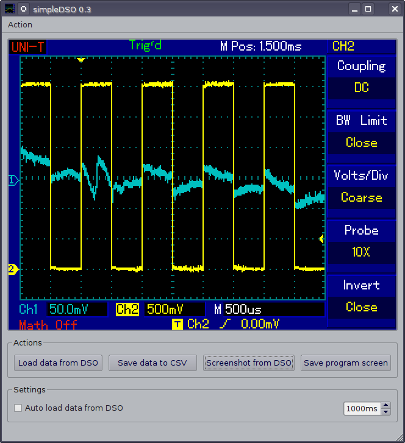
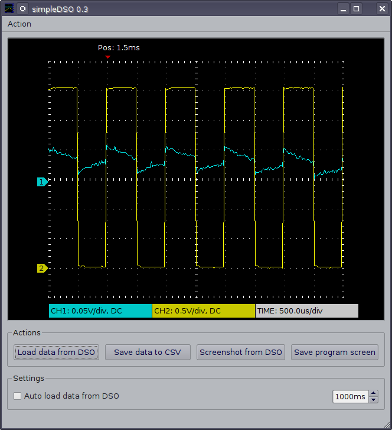

#Simple DSO

This program is usefull with UNI-T digital storage oscilloscopes UT2XXX or UT3XXX.
It's intended to be a replace for original software, which doesn't work under Linux.

Requires pyQT4, QT 4, python 2.5, libusb and usb python module.

If your device is not found, you can add VID and PID to vid_pid.txt file and restart program. 
VID and PID is in decimal NOT hexa !

If you encounter some problems, look into HOWTO.txt file.

# Install  Ubuntu 16

    sudo apt-get install python-qt4

    sudo pip install pyusb

# Install udev rules

    99-uni-t.rules
    

# Screenshot

